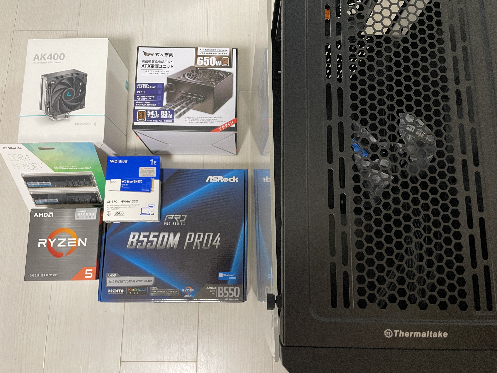
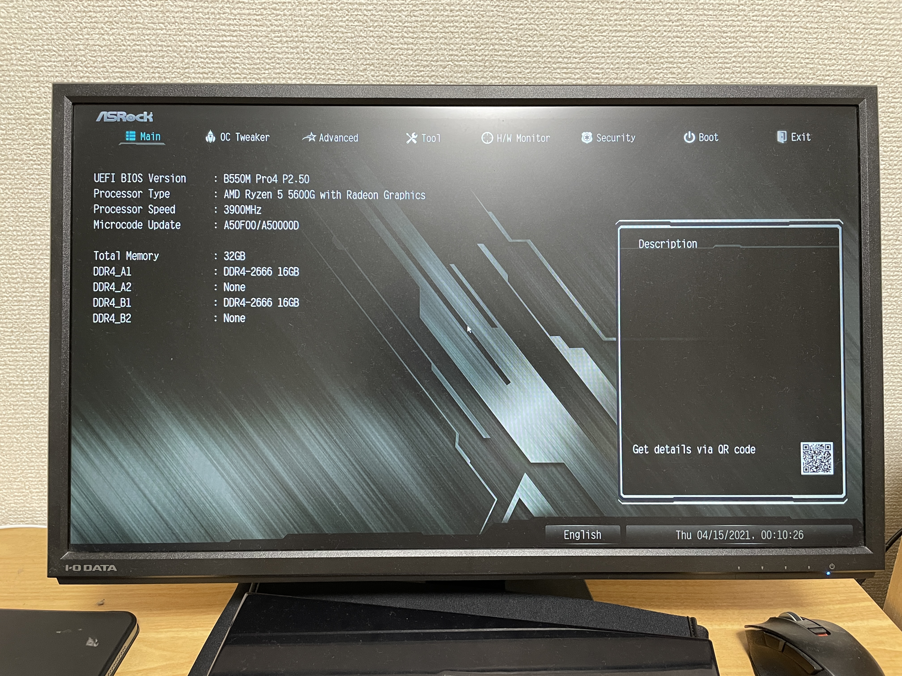
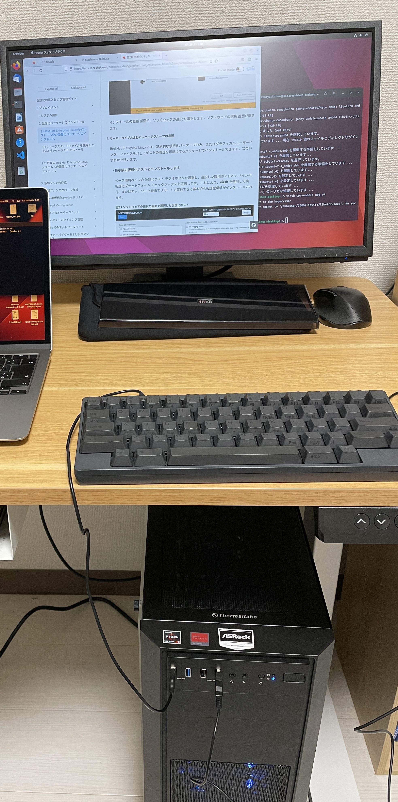

# 自作PC

## パーツ選び

予算が決まったら、自作PCでググって、各パーツを決めていく。
私の場合、ゲームが目的ではなかったため、グラフィックボードがいらなかった。
そこで、CPUにグラフィック機能が搭載されている必要があった。
また、VMを複数台立てたかったため、メモリは必要になる。そこで、16Gのメモリを2つ買ったし、マザーボードもこれから拡張していくことを見越して、4スロットのものにした。

自作PCの価格帯とパーツの書かれたサイトはいくつもある。基本的には、それに従う形にしておき、こだわりがあったり、ゲーミングPC以外の用途であったりする場合には、それに応じて、パーツを変更すればいい。

以下は、私のPCが購入したものである。

- CPU: [AMD Ryzen 5 5600G with Wraith Stealth cooler 3.9GHz 6コア / 12スレッド 70MB 65W 100-100000252BOX](https://www.amazon.co.jp/gp/product/B09CGRFHRK/ref=ppx_yo_dt_b_asin_title_o01_s00?ie=UTF8&psc=1)
- マザーボード: [ASRock AMD Ryzen 5000シリーズ(Soket AM4)対応 B550チップセット搭載 Micro ATX B550M Pro4](https://www.amazon.co.jp/gp/product/B089VY5WVM/ref=ppx_yo_dt_b_asin_title_o01_s00?ie=UTF8&psc=1)
- CPUクーラー: [Deepcool AK400 CPUクーラー R-AK400-BKNNMN-G-1 FN1729](https://www.amazon.co.jp/gp/product/B09ZTQC3BG/ref=ppx_yo_dt_b_asin_title_o00_s02?ie=UTF8&psc=1)
- メモリ: [CFD Standard DDR4 2666 (PC4-21300) 16GB×2枚](https://www.amazon.co.jp/gp/product/B0BB2327SR/ref=ppx_yo_dt_b_asin_title_o00_s00?ie=UTF8&psc=1)
- SSD: [Western Digital ウエスタンデジタル 内蔵SSD 1TB WD Blue SN570](https://www.amazon.co.jp/gp/product/B09JGB6GWG/ref=ppx_yo_dt_b_asin_title_o02_s00?ie=UTF8&psc=1d)
- バッテリー: [玄人志向 電源 KRPW-BKシリーズ 80PLUS Bronze 650W プラグイン](https://www.amazon.co.jp/gp/product/B078HDTV8P/ref=ppx_yo_dt_b_asin_title_o01_s00?ie=UTF8&psc=1)
- PCケース: [Thermaltake Versa H26 Black /w casefan ミドルタワー型PCケース](https://www.amazon.co.jp/gp/product/B076H2CHN3/ref=ppx_yo_dt_b_asin_title_o00_s01?ie=UTF8&psc=1)

## 組み立て

ググったら、いくつもサイトが出てくるが、マザーボードとPCケースの取扱説明書だけあれば、十分に組み立てることは出来る。

組み立ては、以下の順に行なった。

1. マザーボードを袋から取り出す。
2. CPUをマザーボードに取り付ける。CPUクーラーも設置する。CPUクーラーのグリスには触れないように注意する。
3. メモリをマザーボードに取り付ける。
4. SSDをマザーボードに取り付ける。
5. PCケースにバッテリーを入れる。
6. マザーボードをPCケースに固定する。
7. PCケースから出ているUSBやSATAケーブルをマザーボードに繋ぐ。
8. バッテリーから出ている電力供給ケーブルをマザーボードに繋ぐ。
9. 電源を入れる。

**ネジの大きさ（インチネジとミリネジ）**と**配線ミス（プラスとマイナスの向き）**には十分に気をつける必要がある。

ここまで行うと、BIOS画面が立ち上がる。

BIOS画面では、各部品がきちんと認識されているか確認する。

ブータブルUSBを別のPCなどで作成する。OSは好きなものを使えばいいが、今回は、Ubuntu Desktopを使用した。

作成したブータブルUSBを自作PCに挿した状態で、起動し、BIOS画面に行くと、USBが認識されていることが確認できる。

BOOTの優先順位が指定できるため、ブータブルUSBを1番目にして、再起動する。

すると、Ubuntuのインストールが始まる。

